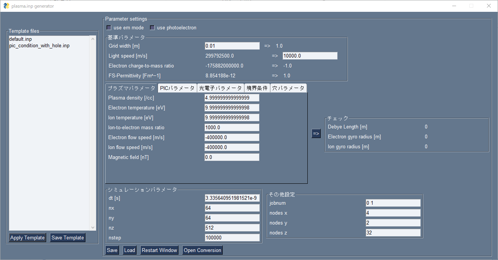
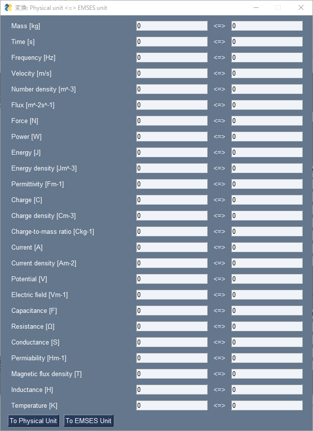

# emses_inp_generator
EMSESに用いるパラメータファイル「plasma.inp」の自動生成ツール



## Installation
```
> pip install git+https://github.com/Nkzono99/emses_inp_generator.git
```

## Usage
```
> ./inpgen.bat
```

or

```
> python src/main.py
```

## Unit Conversion
「Open Converversion」ボタンを押すと単位変換ウィンドウを開くことができます.

このウィンドウではメインウィンドウで指定したパラメータでの物理単位系とEMSES単位系の変換を行うことができます.




## Controlled Parameters
このツールでは以下のパラメータを管理し、それ以外のパラメータは不変に保ちます.

また括弧内がDefaultでないパラメータについては管理するかどうかConfig.iniファイルで設定することができます.

### Default Parameters (Default)
```
&esorem
    emflag
&jobcon
    jobnum(1:)
    nstep
&plasma
    cv
&tmgrid
    dt
    nx
    ny
    nz
&system
    nspec
&mpi
    nodes(1:3)
```

### Simple Plasma Paramters (Default)
```
&plasma
    wp(1:2)
    wc
&intp
    qm(1:2)
    path(1:2)
    peth(1:2)
    vdri(1:2)
```

### PIC Parameters (Default)
```
&intp
    npin(1:2)
```

### Photo Electron Parameters (Control.ControlPhotoelectronParameter)
```
&plasma
    wp(3)
&intp
    qm(3)
    path(3)
    peth(3)
    npin(3)
    np(3)
&emissn
    nflag_emit(3)
    curf(3)
    dnsf(3)
```

### Boundary Parameters (Control.ControlBoundaryParameter)
```
&system
    nfbnd(1:3)
    npbnd(1:3, nspec)
```

### Simple Hole Parameters (Control.ControlSimpleHoleParameter)
```
&ptcond
    zssurf
    xlrechole(1:2)
    ylrechole(1:2)
    yurechole(1:2)
    zlrechole(1:2)
    zurechole(1:2)
&emissn
    nemd(1)
    xmine(1)
    xmaxe(1)
    ymine(1)
    ymaxe(1)
    zmine(1)
    zmaxe(1)
```

### File IO Parameters (Control.ControlFileIOParameter)
```
&digcon
    hdfdigstart
    ifdiag
    ijdiag
    ifxyz(1:7)
    ijxyz(1:3)
    ipahdf(nspec)
    ipadig(nspec)
    ipaxyz(1:6, nspec)
```

### ChargeAcceleration Parameters (Control.ControlChargeAccelerationParameter)
```
$gradema
    grad_coef
    smooth_coef
```
